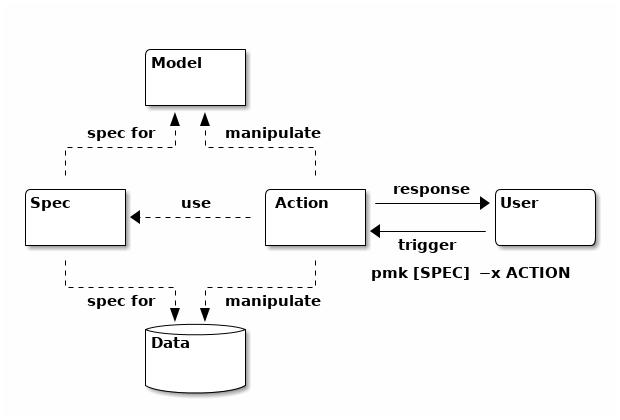

# PYMAKE

[](https://gitter.im/pymake/Lobby?utm_source=badge&utm_medium=badge&utm_campaign=pr-badge&utm_content=badge)

Pymake (pmk) is a machine friendly environment for making reproducible research. It provides tools adapted to ease the creation, maintenance, tracking and sharing of experiments. It has two main paradigms:

* Manage and navigate in your experiments, as a **command-line** interface.
* Models and workflows for Machine Learning experiments, as a **framework**.

It follows a Don't-Repeat-Yourself ([DRY](https://en.wikipedia.org/wiki/Don%27t_repeat_yourself)) philosophy and propose a workflow called Model-Spec-Action (MSA) which is in the spirit of former Model-View-Controller ([MVC](https://en.wikipedia.org/wiki/Model%E2%80%93view%E2%80%93controller)) design pattern but adapted for computer simulations, generally speaking.

It can be represented as follows:



<!-- Build Powerful CLI | Create Beautiful UI | Browse your Experiments  -->


<!--

    * (future) Integration of datasets from [Zenodo](https://www.zenodo.org/)
    * (future) Integration of Data drivers for major type of data beiing:
        * Text (candidate: Nltk, Spacy)
        * Network (candidate: networkx, Graph-tool)
        * Image: (andidate: OpenCV)


-->

# Table of Contents
1. [Features](#1)
2. [Install](#2)
3. [Example](#3)
4. [FAQ](#4)
5. [Documentation](#5)
6. [man pymake](#man)

## Features [](#1)
* Specification of design of experimentation with a simple grammar,
* Indexation of specs, models, scripts and corpus, powered by [Whoosh](https://whoosh.readthedocs.io/en/latest/),
* Customisable Command-line for quick design and experiment testing, powered by [argparse](https://docs.python.org/3/library/argparse.html#module-argparse)
* Command-line auto-completion for specs and scripts,
* Simple grid search specification and navigation,
* Support experiments rules filtering (experimental)
* Support disks I/O management for training/input data and outputs results.
    * Automatic filesystem I/O for data persistence.
    * Automatic compression.
    * Pickle and Json format are currently supported.
* Support plotting and table printing facilities powered by [matplotlib](https://matplotlib.org) and [pandas](https://pandas.pydata.org/)
* Support experiments parallelization powered by [gnu-parallel](https://www.gnu.org/software/parallel/),
* Browse, design and test several models and corpus found in the literature.
    * Integration of models from [scikit-learn](http://scikit-learn.org),

Perspectives:

* IPFS integration to push/fetch/search  design of experimentation, models, scripts and corpus in the decentralized web,
* Web server UI and notebook automatic builder,
* Better documentation (or just a documentation, needs feedback!).


## Installation [](#2)

#### Short

    pip3 install pmk

#### From source

###### Linux dependencies

    apt-get install python3-setuptools python3-pip python3-tk libopenblas-dev gfortran parallel

###### MacOs dependencies

    brew install parallel

###### Install

```bash
git clone https://github.com/dtrckd/pymake
cd pymake && make
```

#### Project Structure

The repo contains two main directories:

* pymake/ -- Code source of pymake,
* [wiki/](https://github.com/dtrckd/pymake/tree/master/wiki) -- Extra documentation
* [repo/](https://github.com/dtrckd/pymake/tree/master/repo) -- Poc projects that are structured with pymake,
    * repo/docsearch: A search-engine in local file (pdf).
    * repo/ml: Machine learning models and experiments.

## Glossary and Types

* *run* or *expe*: It is the term that design one single experiment. it is related to an atomic, sequential code execution.
* *model*: A class that have a method named `fit` and located in `model/`.
* *spec*: A spec is a design of experience. it is defines by a subset of Expspaces, ExpTensors and ExpGroups.
* *script*: A script is a file containing a list of actions,  (see *ExpeFormat*).
* *actions*: An action is basically one method in a script that can be triggered by users. The term script is often used instead of *action* by misuse language.
* *ExpSpace*: A dict-like object used to stored the settings of one *expe*.
* *ExpTensor*: A dict-like object to represent a set of *expe* with common parameters. Each entries that are instance of `list` or `set` are used to build the Cartesian product of those entries. It is used to defined grid search over parameters.
* *ExpGroup*: A list-like object to defined a set of heterogeneous expes.
* *ExpeFormat*: A base class used to create scripts. It acts like a sandbox for the runs. The classes that inherit ExpeFormat should be located in `script/`.
* *ExpDesign*: A base  class used to create design of experience. The experience of type ExpSpace, ExpTensor and ExpGroup should be defined within class that inherit ExpDesign and located in `spec/`.
* *pymake.cfg*: the pymake configuration file, where, for example, the name of the location (model/, spec, model/) can be changed among other settings.
* *gramarg*: It refers to a file, by default in gramarg.py, where you can tune the command line options of pmk by adding your onw. The command line option grammar is powered by the python module argparse.
<!-- grammarg, -->

## Examples [](#3)

We provide an example of a design workflow with pymake by providing a **Search Engine** experience. The project is located in the `repo/docsearch` directory.

The context of the experiment is as follows:
* **Data**: documents to search-in are pdf documents (like articles for example),
* **Model**: A bm25 model, that assumes a information model of bag of words representation.
* **Script**: There are two scripts:
    + a fit script that builds the index of the *input data*,
    + a search script that returns relevant documents, given a *query*.
* Experiment **Spec** are defined individually for each scripts in the attribute `_default_expe` in the class headers.


Setup the experiment (needed just once). You may first need to clone the repo:

```bash
cd repo/docsearch/
make setup
```

You may also need the following package: `apt-get install poppler-utils`

Then a typical pymake usage:

```bash
pmk run --script fit --path path/to/your/pdfs/   # index your pdf documents, take a coffee
pmk run --script search "your text search request"  # show relevant information
```

Or equivalently (aliases):

```bash
pmk -x fit --path path/to/your/pdfs/
pmk -x search "your text search request"
```

Or show only the first match:  `pmk -x search "your text search request" --limit 1`

To add new models, new scripts, or specs,  you need to create it in the dedicated folder following the base class implementations.

Then you can list some information about pymake objects:

* What experiments are there: `pmk -l spec`
* What models are there: `pmk -l model`
* What scripts are there: `pmk -l script`
* Show signatures of methods in scripts ('ir' script)\: `pmk -l --script ir`

## FAQ [](#4)


###### How to see the difference between two specs

    pmk diff spec1 spec2

###### How to tune the command-line options

The pymake.cfg have a settings, by default `gramarg = project_name.grammarg`, which point to the python file gramarg.py. Inside this file you can add command-line options, fully compatible with the `argparse` python module. By default the file contains an empty list. If you want, let's say to set a parameter in your expe with the command line like this `pmk --my_key my_value` you can add a element in the list as follows:

```python
_gram = [
    '--my_key',dict(type=str, help='simple option from command-line'),
]
```

Now suppose that you want to run several expe with different value for an argument, for example `--my-key 10 20` will result in a expTensor with two expe, one with "my-key" at 10 the other at 20. To activate this you can proceed as follows:

```python
from pymake.core.gram import exp_append

_gram = [
    '--my_key',dict(nargs='*', action=exp_append),
]
```

Thus the argument you will get is a str for "my-key". If you want a int let's say, you can proceed as follows:

```python
from functools import partial
from pymake.core.gram import exp_append

_gram = [
    '--my_key',dict(nargs='*',  action=partial(exp_append, _t=int)),
]
```

Finally if you argument "my-key" should be a list of values (int here) and should not create several expe, you can proceed like this:

```python
from functools import partial
from pymake.core.gram import exp_append_uniq

_gram = [
    '--my_key',dict(nargs='*',  action=partial(exp_append_uniq, _t=int)),
]
```


###### How to change a settings in a spec from command-line without specifying it in the grammarg file

Pymake provide a magic command line argument to specify any field in an expe. Let's say you want to give the value `my_value` in the field `my_key` in your expe, then you can do `pmk [...] --pmk my_value=my_key`. You can chain as many key=value pairs like this.


###### How to share memory between all expe/run in a sandbox (ExpeFormat)

If a spec has several run/expe and if the run/expe are launched sequentially (without `--cores` option), then one can use a global container defined in the ExpeFormat sandbox classes in the variable `self.D`. Typically one would init variables at the first experience, process it, and at the final run, do some processing with that variable, as illustrated in the following example:

```python
class MyScripts(ExpeFormat):

    def my_action(self):
        if self.is_first_expe():
            self.D.my_shared_var = 0

        my_shared_var = self.D.my_shared_var
        my_shared_var += 1

        if self.is_last_expe():
            print('Expe total: %d' % self.D.my_shared_var)
```


If the runs are parallelized (with `--cores` options), there is no current implemented way to do it although it is likely to be developed in the future.


###### How to virtually remove a spec term from the commandline

If one parameter is accessible from the command line. You can deactivate it from the command line by giving the argument `_null`, from example `pmk a_complex_spec --my_key _null`. Thus the associated value will takes no value (or its default value.)


###### How to activate Spec/Script auto-completion

The command, `pymake update` build the auto-completion file for bash. To enable it, put the following lines at the end of your `~/.bashrc`:

```bash
if [ -d $HOME/.bash_completion.d ]; then
    if [ ! -z $(ls $HOME/.bash_completion.d) ]; then
        for bcfile in $HOME/.bash_completion.d/*; do
            . $bcfile
        done
    fi
fi
```

If you want to enable the auto-completion, open a new terminal or just run `source ~/.bashrc`.


## Documentation [](#5)


1. Workflow / directory structure
2. pymake commands
4. Designing Experiments
5. Track your data and results
3. pymake.cfg
6. Search and indexation

(to be completed)

----

##### Workflow / Directory Structure

In a pymake project there is 4 main components, associated to 4 directories (you can change those names in the pymake.cfg):

* `data/`: Where are storer input/output of any experiments,
    + contains datasets (and saved results) <!--  selection with the `-c` options and see frontendManager -->,
* `model/`: It represents our understanding of the data,
    + contains models -- every class with a `fit` method <!-- selection with the `-m` options and see ModelManager -->,
* `script/`: Code that operate with the data and models,
    + contains scripts for actions, -- every class that inherit `ExpeFormat` <!-- selection with the `-x` options -->
* `spec/`: It is the specifications of the context of an experiment. In order words, the parameters of an experiment.
    + contains specification of (design) experiments (`ExpSpace`,`ExpTensor` and `ExpGroup`), -- can be given as an argument of pymake.

Along with those directory there is two system files:
* pymake.cfg: at the root of a project (basically define a project) specify the paths for the `data | model | script | spec`  and other global options, <!-- document each entry -->
* gramarg.py: defines the command-line options for a project.


##### Pymake Commands

Initialize a new project in the current directory:

    pymake init

If new models or scripts are added in the project, you'll need to update the pymake index:

    pymake update


List/Search information:

```bash
pmk -l spec   # show available designs of experimentation
pmk -l model  # show available models
pmk -l script # show available scripts
pmk show expe_name # or just pymake expe_name
```

Run experiments:

```bash
pmk run [expe_name] --script script_name [script options...]
# Or shortly (alias):
pmk [expe_name] -x script_name
# Run in parallel:
pmk [expe_name] -x script_name --cores N_CORES
```

Show Paths for disks I/O:

    pmk path [expe_name] [script options...]

Show individuals commands for asynchronously purpose (@deprecated):

    pmk cmd [expe_name] [script options...]

##### Designing experiments

##### Specifications


A design of experiment is defined as one of the following type:
* ExpSpace: A subclass of `dict` => 1 experiment
* ExpTensor: A subclass of `dict` => many experiments (Cartesian Product of all `list` entrie of the dict)
* ExpGroup: A subclass of `list` => group of ExpSpace or ExpTensor.

Design of experiment (ExpSpace, ExpTensor or ExpGroup) must live inside a class that inherit `ExpDesign`. Those classes live in files inside the `spec/` directory. You'll need the following import:
`from pymake import ExpDesign, ExpSpace, ExpTensor, ExpGroup`


The following examples need to be instantiated in class that inherits `ExpDesign`: `class MyDesign(ExpDesign)`.

To specify an unique experiment, one can use the `ExpSpace` class:

```python
exp1 = ExpSpace(name = 'myexpe',
        size = 42,
        key1 = 100,
        key2 = 'johndoe'
        _format = '{name}-{size}-{key1}_{key2}'
        )
```

To specify a **grid search**, one can use the `ExpTensor` class:

```python
exp2 = ExpTensor(name = 'myexpe',
        size = [42, 100],
        key1 = list(range(20, 1000))
        key2 = 'johndoe'
        _format = '{name}-{size}-{key1}_{key2}'
        )
```

Which will results in four experiments where "size" and "key1" settings take different values.

The third class is the `ExpGroup` which allows to group several design of experiments (for example if they have different settings name):

```python
exp3 = ExpGroup([exp1, exp2])
```

You can then run `pmk -l` to see our design of experiments.

##### Designing a Model

Basically, A model is a class inside `model/` that have a method `fit`.

(Doc in progress for more fancy use cases of design.)

##### Designing a Script

A script is a piece of code that you execute which is parameterized by a **specification**. More specifically, Scripts are methods of class that inherits a `ExpeFormat` and that lives inside the `script/` folder.

Once you defined some scripts, you'll be able to list them with `pmk -l script`, and to run them, by their name, with `pmk [specification_id] -x script_name`.

Then each experiments defined in your design (or _default_expe if no specification_id is given), will go through the script method. Then, a bunch of facilities are living inside the method at run-time:

* `self.expe`:  The settings of the current experiment,
* `self._it`: The ith script running inside the script,
* and more (doc in progress)


##### Track your data and results


If a your expe contain models, you can automatically load and save it in a expe if your spec have a field named "model", and that its value point to a valid model in your pmk path. Then you can load your model in a script by calling `self.load_model()`.  If you give the argument `-w` in the command-line, or (equivalent) your expe have have a pair `_write=True`, the model is automatically saved at the end of the expe, after the model have been updated. Then you can reload from its file br calling `self.load_model(load=True)`.


In order to save and analyze your results, each unique experiment need to be identified in a file. To do so, Pymake comes with its own mechanism to map the settings/specification to an unique <filename>s. Pymake use the following conventions:

* <filename>.inf: csv file where each lines contains the state of the iterative process of an experiment, (see \_scv_format)
* <filename>.pk.gz: to save compressed binary object usually at the end of an experiments, and load it after for analysis/visualization,
* <filename>.json: to save information in a JSON format.

There is a bunch of special spec parameters to customize the behaviours of pymake describe in the following sections.


###### Formatting the filename -- _format

The choice of the filename will depends on the settings of the experiments. In order to specify the format of the filename, there is the special settings `--format  str_fmt`. `str_fmt` is a string template for the filename, with braces delimiter to specify what settings will be replaced, example:

Suppose we have the following settings:

```python
settings = ExpSpace(name = 'myexpe',
        size = 42,
        key1 = 100,
        key2 = 'johndoe'
        _format = '{name}-{size}-{key1}_{key2}'
        )
```

The filename for this unique experiment will be 'myexpe-42-100_johndoe'


To give an unique identifier of an expe belonging to a group of experiments (`ExpTensor` or `ExpGroup`) one can use the special term `{_id}` (unique counter identifier) and `${name}` (name of experiment as given in the ExpDesign class) in the `_format` attribute.

###### Formatting the path -- _refdir and _repeat


The path of the filename identifying an expe is automatically inferred by pymake. Thus, if you want to better partition your results, there is two parameters to control the output_path. By default it is something like `.pmk/results/training/<refdir>/<repeat>/output_path`. Thus you can control in your spec parameter the two level of sub-directory customizable with the keys `_refdir` and `_repeat` (in spec). If not given, the default parameters are "default" and '' (void) for respectively `_refdir` and `_repeat`. Note that you can format it with the same syntax explained for `_format`.


###### Specifying what measure to save -- _csv_typo.


<!--
Suppose you a script `fit` that execute a fit method of a given model. You may want to observe the convergence some quantities of your model trough iterations. The way to achieve this with pmk is to use the special settings `_csv_typo` that contains the attribute of your model you want to track.

Once you provide this settings, you need to inject a function in the fit method of your model to track the results.

-->

to complete...

* explain the `_scv_typo` parameters..
* the model need to have a method injected a the end of its iterative process..


## man pymake [](#man)

pymake (pmk) command-line reference.

```bash
init = command$;
command = 'pmk' [command_name] [expedesign_id]* [expe_id]* [pmk_options];
command_name = 'run' | 'runpara' | 'path' | 'cmd' | 'update' | 'show' | 'hist' |  '' ;
expe_id = int; # int identifier of an expe from 0 to; size(exp) -1.
expedesign_id = [exp id/name]; # string identifier to an exp
pmk_options = [pymake special options + project options];
```

### Command_name
If 'expe_name' is empty and `-x` is given, pymake assumes `run` command. If no design spec is given, then the parameters are empty unless the script defines a `_default_expe` expe settings. All settings undefined in a design but defined in the `_default_expe` will take this value. Further, `_default_expe` can point to an existing spec in `spec/`; to do so use the following setting inside `_spec='my_expe_name'`.

Remark: -l and -s (--simulate) options don't execute, they just show things up.

### Expedesign_id
Pick among all (design of) experiments in {spec}. To list them `pmk -l spec`.

### pmk_options
Here are all the special options that own pymake, such as --refdir, --format, --script, -w, -l, -h etc. Additionally, all the options for the current project should be added in the `grammarg.py` file.
