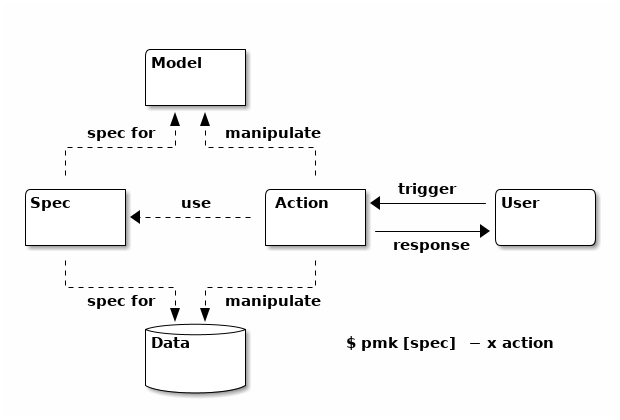

# PYMAKE

Pymake (pmk) is a machine friendly environment for making reproducible research. It provides tools adapted to ease the creation, maintenance, tracking and sharing of experiments. It has two main paradigms :

* Manage and navigate in your experiments, as a **command-line** interface.
* Models and workflows for Machine Learning experiments, as a **framework**.

It follows a Don't-Repeat-Yourself ([DRY](https://en.wikipedia.org/wiki/Don%27t_repeat_yourself)) philosophy and propose new workflow called Model-Spec-Action (MSA) which is in the spirit of former Model-View-Controller ([MVC](https://en.wikipedia.org/wiki/Model%E2%80%93view%E2%80%93controller)) design pattern.

It can be represented as follows:



<!-- Build Powerfull CLI | Create Beautiful UI | Browse your Experiments  -->


<!--  MSA Model-Specification-Action (or DMSA to add the layer data...)

Web develloppment methods introduced Model-View-Controller (MVC) paradigm (and others) to help and improve the workflow of devellopers.

Pymake comes with a similar idea but with a more general, high level point of view, by saying that a a lot of use-cases in computer science can be embedded whitin the following paradigm: 

-Schema-

Explain the model workflow...

-->

# Table of Contents
1. [Features](#1)
2. [Install](#2)
3. [Example](#3)
4. [Documentation](#4)
5. [man pymake](#man)

## Features [](#1)
* Specification of design of experimentations with a simple grammar,
* Indexation of specifications, models, scripts and corpus, powered by [Whoosh](https://whoosh.readthedocs.io/en/latest/),
* Command-line toolkit for quick design and experiment testing,
* Simple grid search specification and navigation,
* Support experiments rules filtering,
* Support disks I/O management for training/input data and outputs results,
* Support experiments parallelization powered by [gnu-parallel](https://www.gnu.org/software/parallel/),
* Browse, design and test several models and corpus found in the literature.

Perspectives :

* Web server UI and notebook automatic builder,
* An online repo to push/fetch/search in design of experimentations, models, scripts and corpus,
* Better documentation (or just a documentation, needs feedback!).


## Install [](#2)

#### Short

    pip3 install pmk 

#### From source

System dependencies : `apt-get install python3-setuptools python3-pip python3-tk`

Numpy/scipy dependencies : `apt-get install libopenblas-dev gfortran`

```bash
git clone https://github.com/dtrckd/pymake
cd pymake && make
```

The repo contains two main directories:

* pymake/ -- Code source of pymake,
* repo/ -- Poc projects that are structured with pymake,
    * repo/docsearch: A search-engine in local file (pdf).
    * repo/ml: Machine learning models and experiments.

## Examples [](#3)

We provide an example of a design workflow with pymake by providing a **Search Engine** experience. The project is located in the `repo/docsearch` directory.

The context of the experiment is as follows :
* **Data** : documents to search-in are pdf documents (like articles for example),
* **Model** : A bm25 model, that assumes a information model of bag of words representation.
* **Script** : There are two scripts :
    + a fit script that builds the index of the *input data*,
    + a search script that returns relevant documents, given a *query*.
* Experiment **Spec** are defined individually for each scripts in the attribute `_default_expe` in the class headers.


Setup the experiment (needed just once). You may first need to clone the repo:

```bash
cd repo/docsearch/
make setup
```

You may also need the following package : `apt-get install poppler-utils`

Then a typical pymake usage :

```bash
pmk run --script fit --path path/to/your/pdfs/   # index your pdf documents, take a coffee
pmk run --script search "your text search request"  # show relevant information
```

Or equivalently (aliases):
```bash
pmk -x fit --path path/to/your/pdfs/
pmk -x search "your text search request"
```

Or show only the first match :  `pmk -x search "your text search request" --limit 1`

To add new models, new scripts, or specs,  you need to create it in the dedicated folder following the base class implementations.

Then you can list some informations about pymake objects :

* What experiments are there: `pmk -l spec`
* What models are there: `pmk -l model`
* What scripts are there: `pmk -l script`
* Show signatures of methods in scripts ('ir' script): `pmk -l --script ir`


## Documentation [](#4)


1. Workflow / directory structure
2. pymake commands
4. Designing Experiments
5. Track your data and results
3. pymake.cfg
6. Search and indexation

(to be completed)

----

##### Workflow / Directory Structure

In a pymake project there is 4 main components, associated to 4 directories :

* `data/`: Where are storer input/output of any experiments,
    + contains datasets (and saved results) <!--  selection with the `-c` options and see frontendManager -->,
* `model/`: It represents our understanding of the data,
    + contains models -- every class with a `fit` method <!-- selection with the `-m` options and see ModelManager -->,
* `script/`: Code that operate with the data and models,
    + contains scripts for actions, -- every class that inherit `ExpeFormat` <!-- selection with the `-x` options -->
* `spec/` : It is the specifications of the context of an experiment. In order words, the parameters of an experiment.
    + contains specification of (design) experiments (`ExpSpace`,`ExpTensor` and `ExpGroup`), -- can be given as an argument of pymake.

Along with those directory there is two system files :
* pymake.cfg : at the root of a project (basically define a project) specify the paths for the `data | model | script | spec`  and other global options, <!-- document each entry -->
* gramarg.py : defines the command-line options for a project. <!-- explaine the exp_append type -->


##### Pymake Commands

Create your own project:

    pymake init

If new models or scripts are added in the project, you'll need to update the pymake index :

    pymake update

List/Search information :

```bash
pmk -l spec   # (or just `pymake -l`) show available designs of experimentation
pmk -l model  # show available models
pmk -l script # show available scripts
pmk show expe_name # or just pymake expe_name
```

Run experiments :

```bash
pmk run [expe_name] --script script_name [script options...]
# Or shortly (alias):
pmk [expe_name] -x script_name
# Run in parallel:
pmk [expe_name] -x script_name --cores N_CORES
```

Show Paths for disks I/O:

    pmk path [expe_name] [script options...]

Show individuals commands for asynchronously purpose (@deprecated) :

    pmk cmd [expe_name] [script options...]

##### Designing experiments

##### Specifications


A design of experiment is defined as one of the following type:
* ExpSpace : A subclass of `dict` => 1 experiment
* ExpTensor : A subclass of `dict` => many experiments (Cartesian Product of all `list` entrie of the dict)
* ExpGroup : A subclass of `list` => group of ExpSpace or ExpTensor.

Design of experiment (ExpSpace, ExpTensor or ExpGroup) must live inside a class that inherit `ExpDesign`. Those classes live in files inside the `spec/` directory. You'll need the following import :
`from pymake import ExpDesign, ExpSpace, ExpTensor, ExpGroup`


The following examples need to be instantiated in class that inherits `ExpDesign`: `class MyDesign(ExpDesign)`.

To specify an unique experiment, one can use the `ExpSpace` class :

```python
exp1 = ExpSpace(name = 'myexpe',
        size = 42,
        key1 = 100,
        key2 = 'johndoe'
        _format = '{name}-{size}-{key1}_{key2}'
        )
```

To specify a **grid search**, one can use the `ExpTensor` class :

```python
exp2 = ExpTensor(name = 'myexpe',
        size = [42, 100],
        key1 = list(range(20, 1000))
        key2 = 'johndoe'
        _format = '{name}-{size}-{key1}_{key2}'
        )
```

Which will results in four experiments where "size" and "key1" settings take different values.

The third class is the `ExpGroup` which allows to group several design of experiments (for example if they have different settings name):

```python
exp3 = ExpGroup([exp1, exp2])
```

You can then run `pmk -l` to see our design of experiments.

##### Designing Model

Basically, A model is a class inside `model/` that have a method `fit`.

(Doc in progress for more fancy use cases of design.)

##### Designing Script

A scipt is a piece of code that you execute which is parametrised by a **specification**. More specifically, Scripts are methods of class that inherits a `ExpeFormat` and that lives inside the `script/` folder.

Once you defined some scripts, you'll be able to list them with `pmk -l script`, and to run them, by their name, with `pmk [specification_id] -x script_name`.

Then each experiments defined in your design (or _default_expe if no specification_id is given), will go through the script method. Then, a bunch of facilities are living inside the method at runtime :

* `self.expe`:  The settings of the current experiment,
* `self._it`: The ith script rennung inside the script,
* and more (doc in progress)


##### Track your data and results

In order to save and analyse your results, each unique experiment need to be identified in a file. To do so, Pymake comes with its own mechanism to map the settings/specification to an unique <filename>s. Pymake use the following conventions:

* <filename>.inf : csv file where each lines contains the state of the iterative process of an experiment,
* <filename>.pk : to save complex objects usually at the end of an experiments, and load it after for analysis/visualisation,
* <filename>.json : to save information of an experiments ("database friendly").

###### formatting the filename -- _format

The choice of the filename will depends on the settings of the experiments. In order to specify the format of the filename, there is the special settings `--format  str_fmt`. `str_fmt` is a string template for the filename, with braces delimiter to specify what settings will be replaced, example :

Suppose we have the following settings :

```python
settings = ExpSpace(name = 'myexpe',
        size = 42,
        key1 = 100,
        key2 = 'johndoe'
        _format = '{name}-{size}-{key1}_{key2}'
        )
```

The filename for this unique experiment will be 'myexpe-42-100_johndoe'


To give an unique identifier of an expe belonging to a group of experiments (`ExpTensor` or `ExpGroup`) one can use the special term `{_id}` (unique counter identifier) and `${name}` (name of experiment as given in the ExpDesign class) in the `_format` attribute.

###### settings the path -- _refdir

By default all experiments results files will be written in the same directory (specify in `pymake.cfg`). In order to give a special subdirectory name for an experiment, the settings `--refdir str` is a string that represents the subdirectory for results files of the experiments.

###### Specifying what data to save in .inf files.

<!--
Suppose you a script `fit` that execute a fit method of a given model. You may want to observe the convergence some quantities of your model trough iterations. The way to achieve this with pmk is to use the special settings `_csv_typo` that contains the attribute of your model you want to track.

Once you provide this settings, you need to inject a function in the fit method of your model to track the results.

-->

to complete...


## man pymake [](#man)

pymake (pmk) command-line reference.

```bash
init = command$;
command = 'pmk' [command_name] [expedesign_id]* [expe_id]* [pmk_options];
command_name = 'run' | 'runpara' | 'path' | 'cmd' | 'update' | 'show' | 'hist' |  '' ;
expe_id = int; # int identifier of an expe from 0 to; size(exp) -1.
expedesign_id = [exp id/name]; # string identifier to an exp
pmk_options = [pymake special options + project options];
```

### Command_name
If 'expe_name' is empty and `-x` is given, pymake assumes `run` command. If 'expedesing_id is empty', then the parameters are empty unless the script defines a `_default_expe` expe settings. All settings undefined in a design but defined in the `_default_exp` will take this value.

Remark : -l and -s (--simulate) options don't execute, they just show things up.

### Expedesign_id
Pick among all (design of) experiments in {spec}. To list them `pmk -l spec` (or just `pmk -l`)

### pmk_options
Here are all the special options that own pymake, such as --refdir, --format, --script, -w, -l, -h etc. Additionally, all the options for the current project should be added in the `grammarg.py` file.
